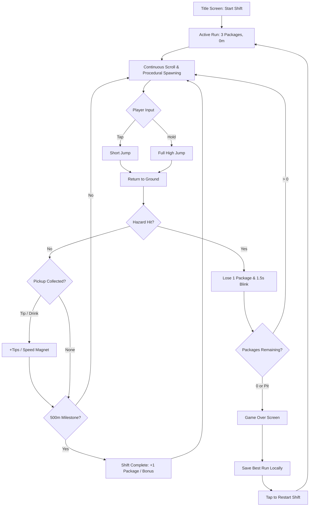
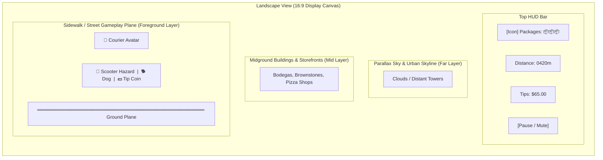
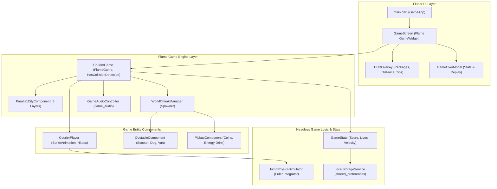
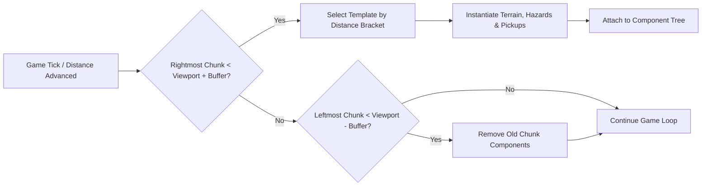

## Goal Capsule

- **Objective:** Deliver a standalone, responsive 2D continuous horizontal scrolling runner game (*Courier Dash*) grounded in contemporary gig-economy courier culture, featuring one-finger jump physics, a 3-package health mechanism, curated Kenney CC0 art and audio integration, and a production-grade tri-platform CI/CD and deployment pipeline for iOS, Android, and Web.
- **Means:** Flutter and Flame 2D game engine with headless test seams and automated GitHub Actions workflows drawing on proven patterns from `taxiGame` and `lunarlog` (KTD1, KD6).
- **Product Authority:** Will (lab administrator).
- **Open Blockers:** None.

---

## Product Contract

Product Contract unchanged.

### Summary
*Courier Dash* is an offline, ad-free 2D horizontal auto-runner where players guide an on-foot gig delivery courier through a bustling cityscape. Players tap and hold to leap over street-level hazards, protecting a backpack payload of 3 packages across an endless run structured with celebratory 500-meter delivery milestone shifts.

### Problem Frame
Simple, twitch-reflex arcade runners often suffer from aggressive ad interruptions, mandatory network connectivity, and bloated meta-economies that disrupt the core flow state. At the same time, the home lab needs an extensible, modern 2D game codebase that exercises the Flutter and Flame engine stack across mobile and browser environments while leveraging the lab's pre-installed Kenney CC0 asset library and existing automated build infrastructure.

### Key Decisions
- **KD1. Gig Economy Courier Theme** — Grounds the game in modern on-foot urban parcel delivery rather than fantasy or corporate tropes. (session-settled: user-directed — chosen over Return-to-Office, Doomscroll, and Cyber Synthwave: chaotic on-foot gig delivery courier theme) Governs R1, R2.
- **KD2. Pure Runner with Package Lives** — Streamlines gameplay to one-finger jump controls where carried packages serve directly as hit points. (session-settled: user-directed — chosen over Runner+Toss and Runner+Slide: pure runner with package lives) Governs R3, R4, R5.
- **KD3. Endless Mode with Milestone Shifts** — Couples infinite procedural difficulty scaling with 500-meter "Shift Completed" intervals that restore lost packages and reward tips. (session-settled: user-directed — chosen over Pure Infinite and Level-Based: endless mode with milestone shifts) Governs R6, R7.
- **KD4. Landscape Orientation** — Prioritizes wide forward visibility, reaction distance, and multi-layer parallax cityscapes. (session-settled: user-directed — chosen over Portrait: landscape orientation) Governs R8, R9.
- **KD5. Tri-Platform Deployment (iOS, Android, Web)** — Establishes automated CI/CD and release pipelines targeting iPhone, Android APK/AAB, and Cloudflare Pages. (session-settled: user-directed — chosen over iOS+Web and iOS-only: tri-platform deployment) Governs R15, R16, R17.
- **KD6. Flutter + Flame Engine** — Reuses proven lab game loop and asset management patterns from `taxiGame` (`flame: ^1.11.0`, `flame_audio: ^2.11.0`). Governs R10, R11, R12.
- **KD7. Curated Kenney Asset Bundling** — Copies specific CC0 sprite packs and audio clips into the repo rather than referencing external paths, ensuring standalone offline builds. Governs R10, R11.
- **KD8. Zero Ads and Fully Offline** — Restricts all persistence to local device storage with zero ad networks, telemetry trackers, or external server calls. Governs R13, R14.

### Actors
- A1. **Player** — Casual gamer playing in short bursts on touchscreens (iOS/Android) or desktop keyboard (Web/desktop).
- A2. **Game Loop Engine** — Flame-driven ticker handling physics updates, procedural obstacle spawning, collision detection, and parallax scrolling at 60 FPS.
- A3. **Local Storage Service** — Client-side persistent key-value store (`shared_preferences`) managing high scores, career tips, and sound preferences.

### Requirements

**Thematic Grounding & World**
- R1. The game presents an urban gig-economy environment where the player avatar is a high-speed on-foot delivery courier wearing a courier backpack and cap.
- R2. Obstacles embody contemporary city delivery hazards: abandoned electric scooters, aggressive porch dogs, construction barriers, open hydrants, and double-parked delivery vans.

**Core Mechanics & Dynamics**
- R3. The player avatar runs continuously to the right at an auto-scrolling speed that accelerates smoothly from baseline (200 px/sec) up to a calibrated velocity cap (550 px/sec) reached at 2,000 meters.
- R4. Single-finger touch input (or spacebar/up-arrow on keyboard) initiates jump dynamics, supporting variable jump heights based on press duration (tap for quick hop, hold for full leap).
- R5. The courier begins each run carrying 3 packages representing 3 discrete life points; colliding with an obstacle drops one package, triggers a brief invulnerability blink (1.5 seconds), and falling into an open pit causes immediate run termination.
- R6. The course spawns collectible items along procedural jump trajectories: tip coins ($1, $5 bills) that increase the run score, cold brew energy drinks providing temporary speed and coin magnet effects (5 seconds), and replacement parcel boxes that restore 1 lost package (capped at 3 maximum).
- R7. Every 500 continuous meters traversed marks a "Shift Milestone", presenting a brief non-disruptive audio-visual celebration banner, awarding a tip bonus, and restoring 1 lost package if below maximum capacity.

**Graphics, Art & Animation Layouts (Kenney CC0 Assets)**
- R8. Visual presentation runs in a fixed 16:9 landscape aspect ratio with letterboxing/pillarboxing support across varying mobile screen sizes.
- R9. The scene renders a three-layer parallax background: far city skyline, midground brownstones and storefronts, and foreground sidewalk terrain with street curbs.
- R10. Sprite assets are drawn from Kenney's CC0 asset packs: character running and jumping frames from `2D assets/Platformer Characters 1`, urban terrain and props from `2D assets/Platformer Pack Remastered`, and interface icons from `UI assets/`.
- R11. Curated asset files along with Kenney's `License.txt` are bundled directly under `assets/` in the project repo to preserve complete build independence.

**Audio Dynamics**
- R12. Audio playback is managed through `flame_audio`, featuring low-latency sound effects for jumping, coin collection, package drops, milestone fanfares, and an upbeat background funk/chiptune loop with mute toggles.

**Platform, Offline & Monetization Standards**
- R13. The game functions completely offline after initial install, requiring zero network connectivity, external API keys, or background server syncing.
- R14. The game contains zero third-party advertisement SDKs, tracking frameworks, or microtransactions.

**CI/CD, Build & Deployment Pipeline (Tri-Platform)**
- R15. A GitHub Actions PR workflow (`pr-checks.yml`) validates all pull requests via `flutter analyze`, `flutter test`, and an unsigned iOS build.
- R16. An iOS release workflow (`ios-release.yml`), modeled on `taxiGame` and `lunarlog`, archives and uploads signed builds to Apple TestFlight and the App Store via Fastlane.
- R17. An automated web deploy workflow (`web-deploy.yml`) builds an optimized HTML5/Canvas release and deploys the static package to Cloudflare Pages.
- R18. An Android build workflow compiles release APK and App Bundle (AAB) artifacts on tagged commits.
- R19. Native app icons are programmatically generated across all required platform densities using an automated icon generation script modeled on `taxiGame/tools/generate_app_icons.sh`.

### Key Flows

- F1. **Standard Run Session**
  - **Trigger:** Player taps "Start Shift" on the main title menu.
  - **Actors:** A1 (Player), A2 (Game Loop Engine), A3 (Local Storage Service).
  - **Steps:**
    1. Game initializes state with 3 packages, 0 distance, 0 tip earnings, and baseline scroll velocity.
    2. Courier runs forward continuously; obstacle and pickup spawning modules generate hazards according to distance-based difficulty brackets.
    3. Player taps screen to jump over hazards and collect tips.
    4. Upon reaching 500m, engine displays milestone banner and replenishes 1 package if needed.
    5. When packages reach 0 or courier falls in a pit, game over sequence triggers, saving personal bests via A3.
  - **Outcome:** Game displays Run Summary card with distance, tips earned, and restart prompt.
  - **Covers R3, R4, R5, R6, R7, R13.**

- F2. **Hazard Collision & Damage Recovery**
  - **Trigger:** Player avatar hitbox intersects an active hazard (e.g. abandoned scooter or barking dog).
  - **Actors:** A1 (Player), A2 (Game Loop Engine).
  - **Steps:**
    1. Engine subtracts 1 package from the HUD backpack meter.
    2. A package drop animation and fumble sound effect play.
    3. Avatar enters a 1.5-second invulnerability state with alpha strobing.
    4. If remaining packages equal 0, run ends immediately; otherwise scrolling continues uninterrupted.
  - **Outcome:** Courier survives with reduced life margin and temporary immunity.
  - **Covers R5, R12.**

### Acceptance Examples

- AE1. **Variable Jump Physics**
  - **Covers R4.**
  - **Given:** The courier is grounded on a sidewalk surface.
  - **When:** The player taps the screen for 80 milliseconds.
  - **Then:** The avatar performs a short hop (approx. 70 pixels high) clearing low obstacles like dropped coffee cups or small scooters.
  - **When:** The player holds the screen for 250 milliseconds or longer.
  - **Then:** The avatar achieves full jump peak (approx. 180 pixels high) clearing tall double-stacked trash bins or jumping onto elevated awnings.

- AE2. **Shift Milestone Package Restoral**
  - **Covers R7.**
  - **Given:** The player has sustained damage and currently holds 1 or 2 packages.
  - **When:** Distance counter reaches 500m, 1,000m, or 1,500m.
  - **Then:** Package count increments by 1 (up to max 3), accompanied by a chime sound effect and celebratory UI ribbon.
  - **Given:** The player already holds the maximum 3 packages at a milestone.
  - **Then:** Package count remains 3, and a 50-dollar tip bonus is awarded instead.

- AE3. **Offline High Score Persistence**
  - **Covers R13, R14.**
  - **Given:** The device has airplane mode enabled.
  - **When:** A run concludes with 1,240m and $145 in tips, exceeding the previous record.
  - **Then:** New record is immediately written to local storage, displays on the post-run screen, and persists across game restarts without throwing network errors.

### Visualizations

#### Gameplay Loop & Package State Machine


#### Landscape Layout Wireframe


### Scope Boundaries

#### Deferred for Later
- Character skin customizer or delivery vehicle upgrades (e.g. unlocking a skateboard or moped).
- Multiple city zones with distinct seasonal weather obstacles (e.g. ice slicks or rain puddles).
- Daily delivery challenge contracts with specific modifier rules.

#### Outside This Product's Identity
- Multiplayer races or online leaderboards (the game is strictly local and self-contained).
- In-game currencies, microtransactions, or energy cooldown timers that block replay.
- External advertisement SDKs, analytics tracking, or user registration requirements.

### Dependencies / Assumptions
- **Dependency:** Flutter SDK 3.47+ and Dart 3.13+ installed on local dev machine and CI runners (matches lab standards on `Williams-Mini`).
- **Dependency:** Kenney CC0 2D Platformer and Audio assets from `C:\git\GameAssets\`.
- **Assumption:** Flame 1.11+ handles 60 FPS sprite batching and canvas rendering smoothly across modern mobile browsers without requiring WebGL fallback hacks.

### Outstanding Questions

#### Deferred to Planning
- What specific sprite frame dimensions and atlas packing approach from Kenney's character sheet should be configured in Flame's `SpriteAnimation` loader?
- Should the speed progression curve use linear scaling or stepped tiers every 250 meters?
- What exact bundle ID and Apple developer team credentials should be configured in Fastlane for App Store deployment?

### Sources / Research
- `C:\git\repos\taxiGame` — reference implementation for Flutter + Flame architecture, Fastlane configuration, app icon generator script (`tools/generate_app_icons.sh`), and App Store release workflow (`.github/workflows/ios-release.yml`).
- `C:\git\repos\lunarlog` — reference implementation for tri-platform GitHub Actions workflows including Cloudflare Pages web deployment (`.github/workflows/web-deploy.yml`) and Android release (`.github/workflows/play-store-release.yml`).
- `C:\git\GameAssets\2D assets\` and `C:\git\GameAssets\Audio\` — local source of CC0 art and sound files.

---

## Planning Contract

### Key Technical Decisions
- **KTD1. Flutter + Flame Engine Stack** — Uses `flame: ^1.11.0` and `flame_audio: ^2.11.0` alongside `flutter_svg: ^2.0.9` and `shared_preferences: ^2.2.2`. Governs R3, R4, R10, R12, R13.
- **KTD2. Repo-Root Project Structure** — Houses the Flutter application directly at the root of `jumpRunner` (matching `lunarlog`) rather than in a nested subdirectory (like `taxiGame`). Simplifies CI paths, testing scripts, and IDE root discovery. Governs R15, R16, R17.
- **KTD3. Procedural Chunk Generation with Clearance Guarantees** — Generates world segments in discrete 960px width chunks composed from pre-validated hazard/pickup templates. Guarantees that obstacle spacing always satisfies the maximum jump clearance envelope regardless of velocity. Governs R3, R5, R6.
- **KTD4. Variable Jump Arc Physics Simulation** — Implements an Euler numerical integrator for courier vertical displacement. An initial impulse provides immediate lift, while an active hold-timer (up to 250ms) applies upward acceleration before full gravity engages, producing crisp 70px to 180px jump arcs. Governs R4.
- **KTD5. Headless Game Loop & Physics Seam** — Decouples jump physics, hazard collision detection, and score progression into pure Dart models (`lib/game/logic/`). Allows comprehensive automated unit and regression testing in headless CI without requiring Flutter testWidgets canvas binding. Governs R15.
- **KTD6. Self-Contained Kenney Asset Subtree** — Copies curated sprite frames and audio files into `assets/` with `assets/LICENSE_KENNEY.txt`. Guarantees isolated builds on GitHub Actions runners without requiring external asset folder access. Governs R10, R11, R12.
- **KTD7. Tri-Platform CI/CD Workflows** — Implements GitHub Actions workflows modeled on `lunarlog` and `taxiGame`: PR validation on `ubuntu-latest` and `macos-latest`, automated Cloudflare Pages web deployment, Fastlane iOS release, and Android APK/AAB compilation. Governs R15, R16, R17, R18.

### High-Level Technical Design

#### Component Architecture


#### Procedural Segment Pipeline


### Output Structure
```text
C:\git\repos\jumpRunner\
├── .github\
│   └── workflows\
│       ├── pr-checks.yml
│       ├── ios-release.yml
│       ├── web-deploy.yml
│       └── android-release.yml
├── assets\
│   ├── audio\
│   │   ├── music\
│   │   └── sfx\
│   ├── images\
│   │   ├── courier\
│   │   ├── environment\
│   │   ├── hazards\
│   │   └── pickups\
│   └── LICENSE_KENNEY.txt
├── fastlane\
│   ├── Appfile
│   └── Fastfile
├── lib\
│   ├── game\
│   │   ├── components\
│   │   │   ├── courier_player.dart
│   │   │   ├── obstacle_component.dart
│   │   │   ├── parallax_city.dart
│   │   │   └── pickup_component.dart
│   │   ├── logic\
│   │   │   ├── game_state.dart
│   │   │   ├── jump_physics.dart
│   │   │   └── world_chunk_manager.dart
│   │   ├── audio_controller.dart
│   │   └── courier_game.dart
│   ├── services\
│   │   └── storage_service.dart
│   ├── ui\
│   │   ├── game_over_modal.dart
│   │   ├── hud_overlay.dart
│   │   └── title_screen.dart
│   └── main.dart
├── test\
│   ├── game_state_test.dart
│   ├── jump_physics_test.dart
│   ├── storage_service_test.dart
│   └── world_chunk_manager_test.dart
├── tools\
│   └── generate_app_icons.sh
├── analysis_options.yaml
└── pubspec.yaml
```

### System-Wide Impact
- **CI Runner Allocation:** PR workflows run lightweight lint and test jobs on Linux runners (`ubuntu-latest` or `lab-linux`), while iOS release builds execute on `Williams-Mini` (Mac mini at `192.168.0.9`) or macOS GitHub-hosted runners to conserve private minutes.
- **Static Cloudflare Pages Hosting:** Web client artifacts compile as standard HTML5/Canvas via `flutter build web --release` without server-side dependencies.

### Risks & Mitigations
- **Physics Tunneling at High Velocity:** Mitigated by clamping maximum scrolling speed at 550 px/sec and utilizing Flame's continuous box collision raycasting rather than single-point hit checks.
- **Audio Lag on Mobile Web:** Mitigated by preloading all audio buffers into `FlameAudio.audioCache` during the initial title screen splash.
- **Touch Input Delay:** Mitigated by binding jump triggers directly to `onTapDown` callbacks rather than waiting for tap release gestures.

---

## Implementation Units

### U1. Greenfield Flutter & Flame Engine Scaffolding
- **Goal:** Initialize the project structure, declare dependencies, set up analysis options, and establish the main game loop entrypoint with parallax city rendering.
- **Requirements:** R8, R9, R10, KTD1, KTD2.
- **Dependencies:** None.
- **Files:**
  - `pubspec.yaml`
  - `analysis_options.yaml`
  - `lib/main.dart`
  - `lib/game/courier_game.dart`
  - `lib/game/components/parallax_city.dart`
  - `test/courier_game_test.dart`
- **Approach:**
  1. Define `pubspec.yaml` with `flame: ^1.11.0`, `flame_audio: ^2.11.0`, `flutter_svg: ^2.0.9`, `shared_preferences: ^2.2.2`, and test dependencies.
  2. Configure `analysis_options.yaml` matching lab strict lints.
  3. Create `lib/main.dart` enforcing fixed landscape orientation (`SystemChrome.setPreferredOrientations`) and launching `CourierGame`.
  4. Create `CourierGame` extending `FlameGame` with `HasCollisionDetection` and fixed 16:9 virtual resolution (960x540) with letterboxing.
  5. Implement `ParallaxCityComponent` rendering 3 distinct scrolling speed layers (skyline 20 px/s, midground storefronts 60 px/s, sidewalk 200 px/s).
- **Patterns to follow:** `C:\git\repos\taxiGame\taxi_game\pubspec.yaml` and `lib/main.dart`.
- **Test Scenarios:**
  - Game initialization: Verify `CourierGame` loads with fixed resolution camera viewport and collision detection mixin active.
  - Orientation lock: Verify landscape orientation constraint flags are registered during app initialization.
- **Verification:** `flutter analyze` passes cleanly and `flutter test test/courier_game_test.dart` executes without errors.

### U2. Curated Kenney 2D & Audio Asset Ingestion
- **Goal:** Extract and bundle curated CC0 Kenney sprite frames, tiles, and audio effects into the repo with licenses.
- **Requirements:** R10, R11, R12, KTD6.
- **Dependencies:** U1.
- **Files:**
  - `assets/LICENSE_KENNEY.txt`
  - `assets/images/courier/run_1.png` ... `run_4.png`
  - `assets/images/courier/jump.png`
  - `assets/images/environment/city_bg_layer1.png` ... `layer3.png`
  - `assets/images/hazards/scooter.png`, `dog.png`, `van.png`, `hydrant.png`
  - `assets/images/pickups/coin.png`, `energy_drink.png`, `package_box.png`
  - `assets/audio/sfx/jump.ogg`, `coin.ogg`, `fumble.ogg`, `milestone.ogg`
  - `assets/audio/music/courier_groove.ogg`
  - `test/asset_inventory_test.dart`
- **Approach:**
  1. Copy selected character running and jumping sprites from `C:\git\GameAssets\2D assets\Platformer Characters 1`.
  2. Copy urban environment tiles and obstacle sprites from `C:\git\GameAssets\2D assets\Platformer Pack Remastered`.
  3. Copy audio SFX and BGM loops from `C:\git\GameAssets\Audio\`.
  4. Copy Kenney `License.txt` to `assets/LICENSE_KENNEY.txt`.
  5. Declare all asset folders in `pubspec.yaml`.
  6. Write an asset inventory test proving all declared asset files exist on disk and are covered by license.
- **Patterns to follow:** `C:\git\repos\taxiGame\taxi_game\assets\licenses\LICENSES.txt` and `test/asset_inventory_test.dart`.
- **Test Scenarios:**
  - Asset inventory validation: Verify all declared asset paths in `pubspec.yaml` physically exist on disk.
  - License coverage verification: Verify `assets/LICENSE_KENNEY.txt` exists and contains CC0 public domain terms.
- **Verification:** `flutter test test/asset_inventory_test.dart` passes.

### U3. Courier Character Component & Variable Jump Physics
- **Goal:** Implement the player courier component with variable jump physics and state management.
- **Requirements:** R3, R4, R5, KTD4, KTD5.
- **Dependencies:** U1, U2.
- **Files:**
  - `lib/game/logic/jump_physics.dart`
  - `lib/game/components/courier_player.dart`
  - `test/jump_physics_test.dart`
  - `test/courier_player_test.dart`
- **Approach:**
  1. Create pure Dart `JumpPhysicsSimulator` with gravity (-980 px/s²), initial jump impulse (320 px/s), and variable hold duration up to 250ms.
  2. Create `CourierPlayer` extending `PositionComponent` with `SpriteAnimationGroupComponent` (states: running, jumping, falling, damaged).
  3. Attach `RectangleHitbox` calibrated to character torso, avoiding unfair collision on trailing limbs.
  4. Implement `onTapDown` and `onTapUp` handlers driving variable jump height.
- **Patterns to follow:** `taxiGame` vehicle collision bounds and physics ticker.
- **Test Scenarios:**
  - Short tap jump (Covers AE1): Input hold time of 80ms results in peak jump height between 65px and 75px.
  - Full hold leap (Covers AE1): Input hold time of 250ms results in peak jump height between 175px and 185px.
  - Ground collision reset: Avatar returns to baseline Y coordinate and re-enters running animation state upon landing.
  - Mid-air tap rejection: Tapping while in mid-air does not trigger a second jump impulse.
- **Verification:** `flutter test test/jump_physics_test.dart test/courier_player_test.dart` passes.

### U4. Procedural Obstacle, Hazard & Pickup Spawner Pipeline
- **Goal:** Build the procedural chunk generator that spawns hazards, coins, and boosts with clearance validation.
- **Requirements:** R2, R3, R5, R6, KTD3.
- **Dependencies:** U1, U2, U3.
- **Files:**
  - `lib/game/components/obstacle_component.dart`
  - `lib/game/components/pickup_component.dart`
  - `lib/game/logic/world_chunk_manager.dart`
  - `test/world_chunk_manager_test.dart`
- **Approach:**
  1. Create `ObstacleComponent` (types: scooter, dog, hydrant, van) with collision hitboxes and hazard damage payload.
  2. Create `PickupComponent` (types: coin $1/$5, energy drink, package restore) with floating sine-wave bobbing animation.
  3. Create `WorldChunkManager` generating 960px slices with guaranteed clearance envelopes based on current scroll velocity.
  4. Implement progressive speed acceleration from 200 px/s to 550 px/s across 2,000 meters.
  5. Pool and recycle offscreen components passing left of viewport to avoid garbage collection spikes.
- **Test Scenarios:**
  - Guaranteed clearance: Verify distance between consecutive obstacles is strictly greater than minimum courier jump landing footprint across all speed brackets.
  - Speed scaling curve: Verify game speed increases from 200 px/s at 0m to exactly 550 px/s at 2,000m.
  - Component recycling: Verify obstacles exiting left of the -200px boundary are removed from the active tree.
  - Pickup collection collision: Verify player hitbox intersection with coin triggers collection and removes coin.
- **Verification:** `flutter test test/world_chunk_manager_test.dart` passes.

### U5. HUD Overlay, Shift Milestone Engine & Local Storage Persistence
- **Goal:** Implement the top HUD, package life meter, milestone celebrations, game over screen, and offline score saving.
- **Requirements:** R5, R6, R7, R13, R14.
- **Dependencies:** U3, U4.
- **Files:**
  - `lib/game/logic/game_state.dart`
  - `lib/services/storage_service.dart`
  - `lib/ui/hud_overlay.dart`
  - `lib/ui/game_over_modal.dart`
  - `lib/ui/title_screen.dart`
  - `test/game_state_test.dart`
  - `test/storage_service_test.dart`
- **Approach:**
  1. Create `GameState` managing package count (default 3), total tips, current distance, and run lifecycle (idle, running, paused, gameOver).
  2. Implement milestone checker: every 500m awards package restore (or $50 bonus if full) and fires milestone event.
  3. Implement damage handler: hazard collision decrements package count by 1 and grants 1.5s invulnerability.
  4. Create `LocalStorageService` wrapping `shared_preferences` for offline high-distance and career-tips persistence.
  5. Build Flutter UI widgets: `HUDOverlay` (top bar with package icons, distance, tips), `GameOverModal` (run recap), and `TitleScreen`.
- **Test Scenarios:**
  - Damage and package loss: Colliding with hazard reduces packages from 3 to 2 and activates 1.5s invulnerability timer.
  - Terminal death: Reaching 0 packages triggers game-over state.
  - Shift milestone restoral (Covers AE2): Reaching 500m with 2 packages restores package count to 3.
  - Shift milestone bonus (Covers AE2): Reaching 500m with 3 packages awards $50 tip bonus without exceeding 3 packages.
  - Offline score saving (Covers AE3): High score and career tips write to `shared_preferences` and persist across service re-initialization.
- **Verification:** `flutter test test/game_state_test.dart test/storage_service_test.dart` passes.

### U6. Audio System & Low-Latency Sound Effects
- **Goal:** Implement audio controller with low-latency SFX triggers, looping background music, and user mute persistence.
- **Requirements:** R12, R13.
- **Dependencies:** U2, U5.
- **Files:**
  - `lib/game/audio_controller.dart`
  - `test/audio_controller_test.dart`
- **Approach:**
  1. Create `GameAudioController` wrapping `flame_audio` methods (`FlameAudio.play`, `FlameAudio.bgm`).
  2. Provide discrete methods for `playJump()`, `playCoin()`, `playFumble()`, `playMilestone()`, and `startMusic()`.
  3. Preload all SFX assets on game initialization.
  4. Implement mute state toggle persisted to `LocalStorageService`.
  5. Provide mock audio platform interface for testing without touching hardware audio method channels.
- **Patterns to follow:** `taxiGame/lib/services/audio_service.dart`.
- **Test Scenarios:**
  - Sound effect invocation: Triggering `playJump()` invokes audio player with correct asset path.
  - Mute persistence: When muted, SFX playback calls are skipped and mute setting persists to storage.
  - Background music loop: Calling `startMusic()` starts looping BGM track.
- **Verification:** `flutter test test/audio_controller_test.dart` passes.

### U7. Tri-Platform CI/CD Workflows & Fastlane Deployment
- **Goal:** Configure GitHub Actions workflows for PR validation, Cloudflare Pages web deployment, Fastlane iOS release, and Android builds.
- **Requirements:** R15, R16, R17, R18, R19, KTD7.
- **Dependencies:** U1, U5.
- **Files:**
  - `.github/workflows/pr-checks.yml`
  - `.github/workflows/ios-release.yml`
  - `.github/workflows/web-deploy.yml`
  - `.github/workflows/android-release.yml`
  - `fastlane/Appfile`
  - `fastlane/Fastfile`
  - `tools/generate_app_icons.sh`
- **Approach:**
  1. Create `.github/workflows/pr-checks.yml`: runs on PRs; executes `flutter pub get`, `flutter analyze`, `flutter test`, and unsigned iOS build (`flutter build ios --release --no-codesign`).
  2. Create `.github/workflows/web-deploy.yml`: runs on main push; executes `flutter build web --release` and deploys `build/web` to Cloudflare Pages via `cloudflare/wrangler-action`.
  3. Create `.github/workflows/ios-release.yml`: runs on tag or workflow dispatch; sets up certificates, runs Fastlane to build and upload to TestFlight / App Store.
  4. Create `.github/workflows/android-release.yml`: builds release APK and App Bundle (`.aab`) and uploads GitHub release artifacts.
  5. Port icon generator script `tools/generate_app_icons.sh` to generate all iOS and Android icon densities from a 1024x1024 master.
- **Patterns to follow:** `taxiGame/.github/workflows/flutter-builds.yml`, `taxiGame/.github/workflows/ios-release.yml`, and `lunarlog/.github/workflows/web-deploy.yml`.
- **Test Scenarios:**
  - Workflow YAML validation: Verify all GitHub Actions workflow files parse as valid syntax without schema errors.
  - Fastlane syntax check: Verify Fastfile contains lanes for test and release.
- **Verification:** YAML linter confirms all workflow syntax is valid.

---

## Verification Contract

### Automated Verification Commands
| Command | Working Directory | Purpose | Pass Criteria |
|---|---|---|---|
| `flutter analyze` | `.` | Static analysis & lint enforcement | Zero warnings, zero errors |
| `flutter test` | `.` | Full automated unit & physics test suite | 100% tests passing |
| `flutter build ios --release --no-codesign` | `.` | Verify iOS device compilation | Build succeeds and produces Runner.app |
| `flutter build web --release` | `.` | Verify Web HTML5/Canvas compilation | Build succeeds and produces `build/web/` |
| `flutter build appbundle --release` | `.` | Verify Android release packaging | Build succeeds and produces `.aab` |

---

## Definition of Done

- **Code Quality:** All code satisfies `analysis_options.yaml` with zero linter errors or warnings.
- **Test Coverage:** All 7 implementation units pass their designated test scenarios covering jump physics, procedural generation, package life state machine, and offline persistence.
- **Asset Integrity:** Curated Kenney sprites and audio files are bundled under `assets/` with valid `LICENSE_KENNEY.txt`.
- **Platform Compatibility:** Application compiles cleanly for iOS, Android, and Web targets.
- **CI/CD Readiness:** GitHub Actions workflows (`pr-checks.yml`, `ios-release.yml`, `web-deploy.yml`, `android-release.yml`) are configured and syntactically valid.
- **Cleanup:** No experimental scratch files or temporary debug prints remain in the diff.
